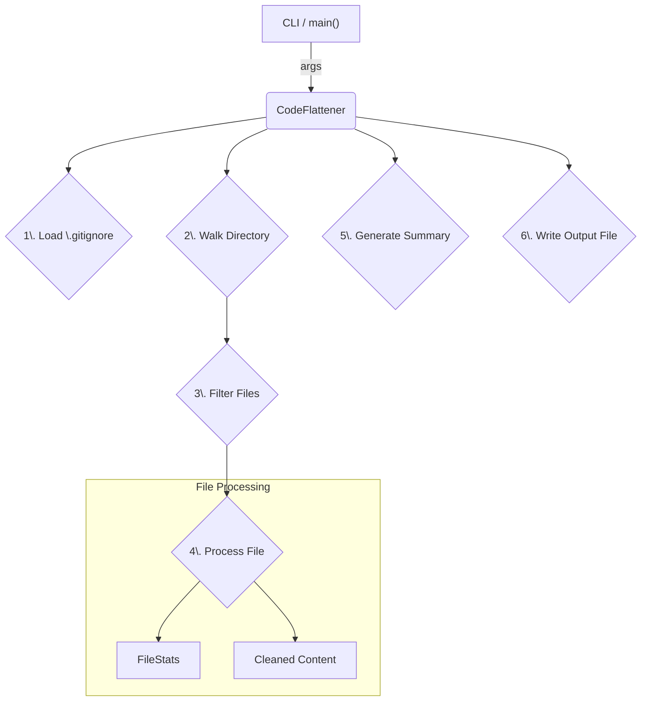

# DES: CodeFlattener Architecture

## 1. Introduction

This document outlines the system architecture for the `CodeFlattener` utility. The purpose of this tool is to process a source code repository, remove non-essential content (like comments and whitespace), and consolidate the relevant code into a single, token-efficient Markdown file. This output is optimized for use in Large Language Model (LLM) prompts and other agentic workflows.

The architecture prioritizes modularity, clarity, and adherence to the technical guidelines provided.

## 2. System Overview

`CodeFlattener` is a command-line application that operates on the local filesystem. It is designed as a single, self-contained Python script with no external dependencies beyond the standard library.

### 2.1. High-Level Design

The system follows a sequential, multi-stage processing pipeline:

1.  **Initialization**: The `CodeFlattener` class is instantiated with paths and configuration.
2.  **Configuration Loading**: Ignore patterns from `.gitignore` and command-line arguments are loaded and compiled into regex.
3.  **File Traversal**: The tool recursively walks the specified root directory.
4.  **File Filtering**: Each file and directory is checked against the compiled ignore patterns.
5.  **File Processing**: Supported files are read, cleaned, and formatted.
6.  **Content Aggregation**: The processed content of all files is collected.
7.  **Summary Generation**: A project summary and file structure tree are created.
8.  **Output Generation**: All aggregated content is written to a single output Markdown file.

### 2.2. Component Diagram

The following diagram illustrates the primary components and their interactions.


    <!-- style B fill:#f9f,stroke:#333,stroke-width:2px -->

## 3. Core Components

### 3.1. `CodeFlattener` Class

This is the main orchestrator of the flattening process.

- **Responsibilities**:
    - Manages configuration (paths, ignore patterns, size/token limits).
    - Loads and parses `.gitignore` files.
    - Traverses the file system.
    - Coordinates the filtering, processing, and aggregation of file content.
    - Generates the final summary and output file.
- **Key Methods**:
    - `flatten()`: The main entry point that executes the entire workflow.
    - `_load_gitignore()`: Reads and converts gitignore patterns to regex.
    - `_should_ignore()`: Determines if a file or directory should be skipped.
    - `_process_file()`: Handles the reading, cleaning, and formatting of a single file.
    - `_clean_code()`: Implements the logic for removing comments and whitespace for various languages.
    - `save_output()`: Writes the final aggregated content to the destination file.

### 3.2. `FileStats` Dataclass

A simple data structure for holding statistics about each processed file.

- **Attributes**:
    - `size`: The original file size in bytes.
    - `tokens`: An estimated token count of the cleaned content.
    - `lines`: The number of lines in the cleaned content.

## 4. Key Processes and Workflows

### 4.1. Ignore Pattern Handling

1.  Default patterns (e.g., `.git`, `__pycache__`) are defined.
2.  The `.gitignore` file in the root directory is read line by line.
3.  Each non-comment line is converted from a glob pattern to a regex pattern using the `_glob_to_regex` helper method. This conversion handles wildcards (`*`, `**`) and directory-specific patterns.
4.  Command-line ignore patterns are also converted.
5.  All patterns are combined into a single list (`all_ignore_patterns`).
6.  During directory traversal, `_should_ignore` checks each file/directory's relative path against this list.

### 4.2. Code Cleaning Process

1.  The file's extension is used to look up a dictionary of language-specific regex patterns for comment removal.
2.  Single-line comments are removed first.
3.  Multi-line comments (and docstrings) are removed next.
4.  The resulting code is split into lines.
5.  Any line that is empty or contains only whitespace is discarded.
6.  The remaining lines are joined back together with newline characters, preserving indentation.

## 5. Data Model

The primary data stored during runtime is the `flattened_content` (a list of formatted strings) and `file_stats` (a dictionary mapping relative file paths to `FileStats` objects). The design is stateless regarding the file system after the initial traversal.

## 6. Configuration

Configuration is managed via command-line arguments using Python's `argparse` library.

- **Key Parameters**:
    - `root_dir`: The target directory to flatten.
    - `--output`: The destination file for the output.
    - `--ignore`: Custom ignore patterns.
    - `--max-file-size`: File size limit in MB.
    - `--max-tokens`: Token limit per file.

Sensitive data is not handled by this application, so `.env` files are not required but are ignored by default.

## 7. Error Handling and Logging

- **Error Handling**:
    - The application raises specific errors for critical failures (e.g., `FileNotFoundError` for an invalid root directory, `PermissionError` for output write failures).
    - Non-critical errors during the processing of a single file are logged, and the process continues with the next file.
- **Logging**:
    - The standard `logging` module is used.
    - Two levels of verbosity are supported (`INFO` by default, `DEBUG` via the `-v` flag).
    - Log messages provide clear context on the application's state and actions.

## 8. Technology Stack

- **Language**: Python 3.
- **Key Libraries**: `os`, `re`, `logging`, `argparse`, `pathlib`, `dataclasses`.
- **Dependencies**: No external dependencies are required, aligning with the principle of minimizing external libraries.

## 9. Scalability and Performance

- The application's performance is bound by I/O operations and the number of files in the target directory.
- Memory usage is proportional to the total size of the cleaned code content stored in the `flattened_content` list.
- The `max_file_size` and `max_token_length` configurations serve as safeguards against processing excessively large files that could impact performance and memory.

## 10. Security Considerations

- The application operates with read-only access to the source directory and write access only to the specified output file.
- It does not execute any code from the files it processes.
- Path manipulation is handled using `os.path` and `pathlib` to mitigate risks associated with path traversal vulnerabilities.

## 11. Deployment and Execution

The utility is executed as a standard Python script from the command line:

```bash
python code_flattener.py [ROOT_DIRECTORY] -o [OUTPUT_FILE]
